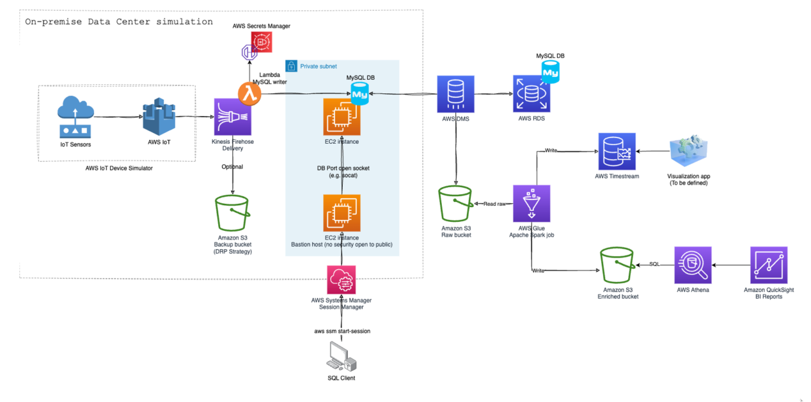

# IoT_Pipeline 

End-End Pipeline for IoT simulator to AWS CDK and IoT Core for Migrating IoT-Based Data to AWS

## Aim
This project is the first part of the IoT Data Migration series using AWS CDK. In this project, we
will cover using an AWS IoT device Simulator to replicate an On-Premise Data Center
infrastructure by ingesting real-time IoT-based data. The services we’ll be using are AWS CDK
(CloudFormation), AWS IoT core, Kinesis Firehose, Lambda, AWS S3, EC2, MariaDB, and
AWS Secrets manager. The second project in this series will be migrating and analyzing the
data to “AWS Cloud Premise” using DMS, RDS, Glue, AWS Timestream, and QuickSight.
Finally, the third project will act as a mini-course to dive deep into the concepts and workings of
Infrastructure-as-a-Code (IaC) using AWS CDK (Cloud Development Kit).

## Data Description

Using the Device Simulator, we will simulate and deal with the geoLocation data of multiple
devices parallelly within the vicinity of a popular entertainment complex in London called The O2
Arena.

## Tech Stack:
* Framework: AWS CDK
* Language: Python
* Services: AWS IoT core, Kinesis Firehose, AWS Lambda, MariaDB, AWS S3, AWS Secrets
Manager